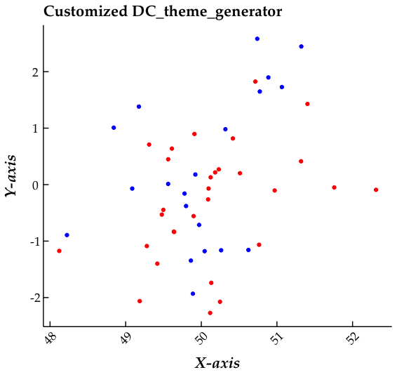

# DC_theme_generator : a theme generator for ggplot2


```ggplot2``` is a fantastic package made available by the great people over at [tidyverse](https://ggplot2.tidyverse.org/). ```ggplot2``` is great for designing plots layer by layer in R. Although ```ggplot2``` provides theming capabilities, the default choices available through the package can seem mundane and unapplealing for making publication quality figures.

See these examples:


I found myself writing these ```ggplot2::theme()``` objects everytime I wanted to plot something. So I wrote an R function that allows me to customize some key aspects of ```ggplot2::theme()``` and have a bit more granular control over the aesthetics of the "canvas" of my plots so to speak.

```DC_theme_generator``` has handpicked defaults that make a plot look beautiful right out of the box.

## Using DC_theme_generator

```R
source('https://raw.githubusercontent.com/dchakro/ggplot_themes/master/DC_theme_generator.R')

customtheme <- DC_theme_generator(type='L')
ggplot()+geom_point()+customtheme
```

More detailed usage instructions along with an example can be found in the R script ```source.R``` in this repo.

Here is an example tweaking some of the defaults:

```R
source('https://raw.githubusercontent.com/dchakro/ggplot_themes/master/DC_theme_generator.R')
customtheme <- DC_theme_generator(type = 'L',
                                  legend = 'F',
                                  ticks = 'in',
                                  x.axis.angle = 45,
                                  hjust = 0.5,
                                  vjust = 0.5,
                                  fontsize.cex = 1.5,
                                  fontfamily = 'Palatino',
                                  ax.fontstyle = "bold.italic")

ggplot(data = dat, aes(x=X,y=Y,color=Class)) + geom_point() + scale_color_manual(values=c("red","blue")) + xlab("X-axis") + ylab("Y-axis") + ggtitle("Customized DC_theme_generator") + customtheme
```

The above theme results in a canvas like this:

